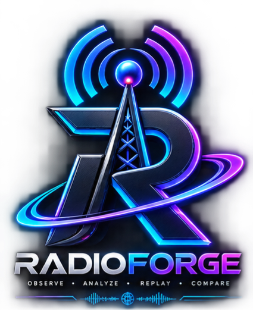

# 📡 RADIOFORGE

<p align="center">



</p>

<p align="center">

<b>رصدخانه شخصی شبکه برای Android</b>

</p>

---

## 📱 دانلود برنامه

### آخرین نسخه APK

[⬇️ دانلود مستقیم RADIOFORGE](https://github.com/shanduzgil/radioforge/releases/latest/download/RadioForge.apk)

### صفحه Releases

https://github.com/shanduzgil/radioforge/releases

---

## ✨ RADIOFORGE چیست؟

RADIOFORGE یک ابزار Android برای ثبت و تحلیل اطلاعات شبکه‌ای است که سیستم‌عامل و دستگاه در اختیار برنامه قرار می‌دهند.

هدف پروژه تبدیل داده‌های فنی شبکه به اطلاعات قابل‌فهم، قابل‌ذخیره و قابل‌تحلیل است.

---

## 📶 قابلیت‌ها

- LTE / 5G در دستگاه‌های پشتیبانی‌شده
- تشخیص اپراتور و نوع شبکه
- اطلاعات Cell در صورت دسترسی Android
- RSRP
- RSRQ
- RSSI / RSSNR
- SINR
- Cell ID / NCI
- PCI
- TAC
- EARFCN / NRARFCN
- ثبت Session
- ذخیره محلی
- گزارش و Export
- رابط فارسی و RTL
- فونت فارسی
- طراحی Dark و مدرن
- Local-first
- Privacy-first

---

## 🚀 نصب

1. فایل APK را دانلود کنید.
2. فایل `RadioForge.apk` را در Android باز کنید.
3. مجوزهای موردنیاز را تأیید کنید.
4. برنامه را اجرا کنید.
5. پایش شبکه را شروع کنید.

---

## 🛠 ساخت از سورس

```bash
./gradlew assembleDebug
```

APK:

```text
app/build/outputs/apk/debug/app-debug.apk
```

---

## ⚠️ محدودیت فنی

RADIOFORGE اطلاعاتی را که Android یا مودم در اختیار برنامه قرار نمی‌دهد، حدس نمی‌زند.

این پروژه ضبط مستقیم نمونه‌های خام RF/IQ یا Baseband را انجام نمی‌دهد.

---

## 🔐 حریم خصوصی

RADIOFORGE با رویکرد Local-first طراحی شده است.

داده‌های Session به‌صورت پیش‌فرض روی دستگاه نگهداری می‌شوند و برای کارکرد پایه پروژه Backend اجباری وجود ندارد.

---

## 📜 نسخه

آخرین Release:

**radioforge**

---

## 🔗 لینک‌ها

Repository:

https://github.com/shanduzgil/radioforge

Releases:

https://github.com/shanduzgil/radioforge/releases

دانلود مستقیم:

https://github.com/shanduzgil/radioforge/releases/latest/download/RadioForge.apk

---

<div align="center">

**RADIOFORGE — Observe • Analyze • Replay • Compare**

</div>
